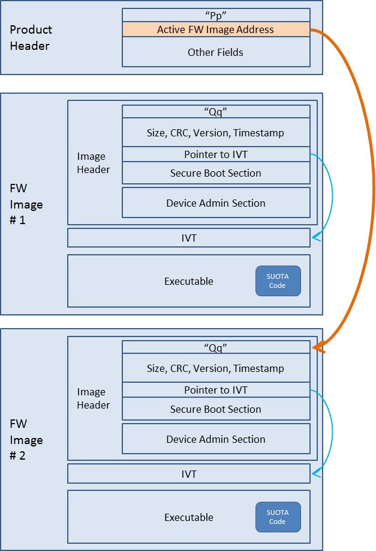

# DA1469x Software Upgrade (OTA)

### 3줄 요약
1. Android 나 iOS 기기에서 기기의 플래시 메모리로 새 펌웨어 이미지를 보냅니다.
2. 기기는 업데이트 완료를 위해 재부팅 됩니다.
3. 재부팅 과정에서 최종 검증 및 새로운 이미지의 활성화가 진행됩니다.

## Flow
### 1. 초기 플래시 메모리 프로그래밍 (OTA에는 해당하지 않는다.)

### 2. Android 나 iOS 기기에서 해당 기기로 새 펌웨어 전송

서
Android 나 iOS 기기에서 해당 기기로 새 펌웨어 전송한 후 해당 펌웨어는 이전 펌웨어 이미지 다음 위치에 기록된다.

### 3. Product Header 포인터의 펌웨어 참조 위치를 새로운 이미지로 변경
 

간단히 참조 위치를 이전 펌웨어 이미지에서 새로운 이미지로 변경한다.

### 참조
[Dialog 공식문서](http://lpccs-docs.dialog-semiconductor.com/um-b-092-da1469x_software_platform_reference/User_guides/User_guides.html#)