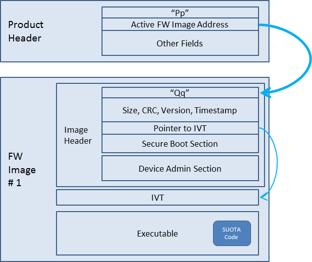
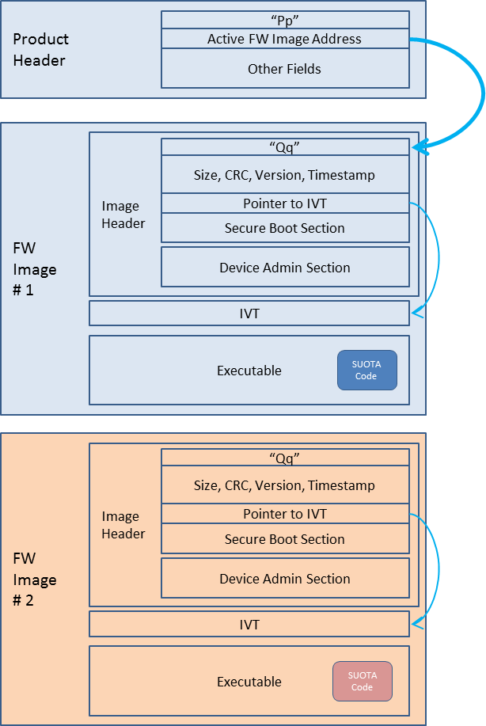
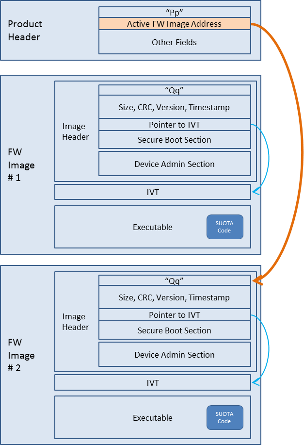

# DA1469x Software Upgrade (OTA)

### TL;DR
1. Android or iOS device transfer a new firmware image to the Flash memory
2. the device reboots to complete the update
3. The final verification and activation of the new image is performed by the ROM boot loader on the next reboot.

## Flow
### 1. Write Initial Image (Non OTA)

### 2. Android or iOS device transfer firmware

Android or iOS device send newer firmware image to Device and that will written next to previous image
### 3. Product Header points new firmware
 

Simply change reference from previous image to newer image

### Reference
[Dialog Official Document](http://lpccs-docs.dialog-semiconductor.com/um-b-092-da1469x_software_platform_reference/User_guides/User_guides.html#)